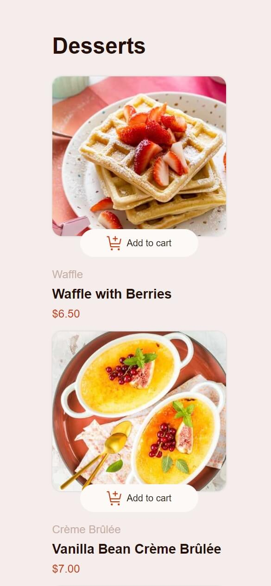
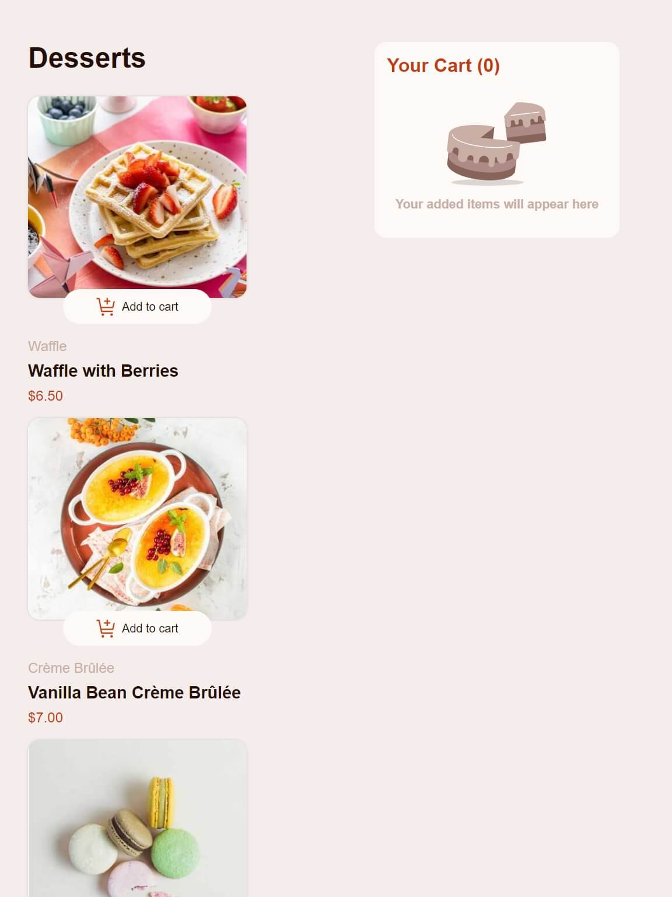
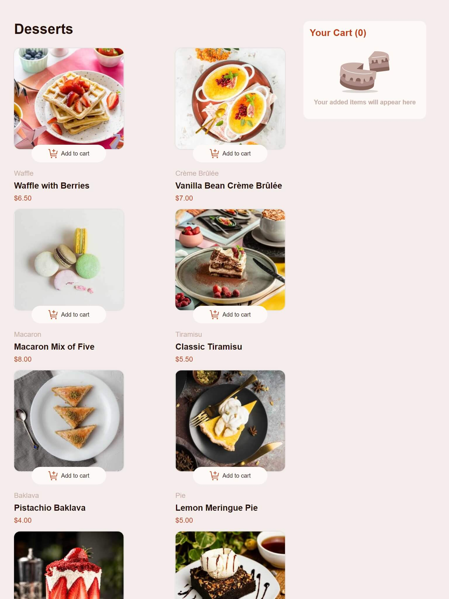
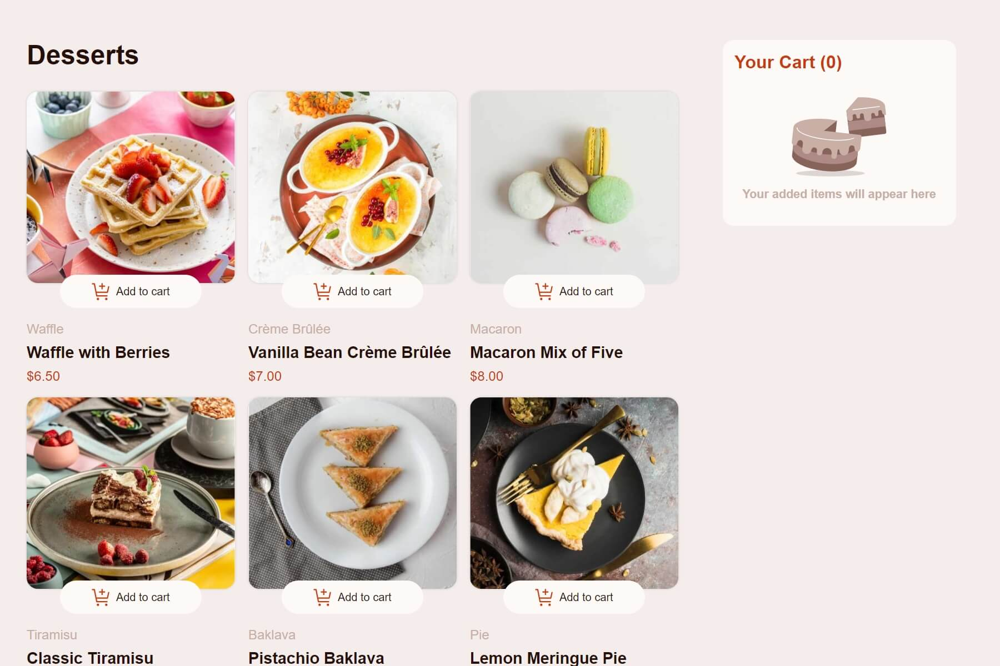

# Frontend Mentor - Product list with cart solution

Hi! This is my solution to the [Product list with cart challenge on Frontend Mentor](https://www.frontendmentor.io/challenges/product-list-with-cart-5MmqLVAp_d). I hope you'll enjoy it and let me know any improvements that I could adopt in the future.

## Table of contents

- [Overview](#overview)
  - [The challenge](#the-challenge)
  - [Screenshot](#screenshot)
  - [Links](#links)
- [My process](#my-process)
  - [Built with](#built-with)
  - [What I learned](#what-i-learned)
  - [Continued development](#continued-development)
  - [Useful resources](#useful-resources)
- [Author](#author)

## Overview

### The challenge

Users should be able to:

- Add items to the cart and remove them ✅
- Increase/decrease the number of items in the cart ✅
- See an order confirmation modal when they click "Confirm Order" ✅
- Reset their selections when they click "Start New Order" ✅
- View the optimal layout for the interface depending on their device's screen size ✅
  **Note: the supported screen sizes are: 375px, 768px, 1024px, and 1250px**
- See hover and focus states for all interactive elements on the page ✅

### Screenshot

This screenshots were taken with [Responsively App](https://responsively.app/) **quick screenshot** functionality.

#### Mobile solution



#### Tablet solution



### Desktop 1024px screen size



### Desktop 1250px screen size



### Links

- Solution URL: [Add solution URL here](https://your-solution-url.com)
- Live Site URL: [Add live site URL here](https://your-live-site-url.com)

## My process

### Built with

- Semantic HTML5 markup
- CSS custom properties
- Flexbox
- CSS Grid
- Mobile-first workflow
- DOM API
- Fetch API
- Rollup

### What I learned

#### Rollup

As its documentation says:

> Rollup is a module bundler for JavaScript that compiles small pieces of code into something larger and more complex.

When we use it, we end up with one large JavaScript file (most of the time named _bundle.js_), which contains all the pieces of code that were allocated in different files and let us use the **ES Modules** without any worry about supporting old browsers.

1. Instalation.

```bash
npm install rollup --save-dev
```

2. Configuration.
   In the root folder of our project, we create a file named _rollup.config.mjs_ which contains the basic configuration like the input's file name (_main.js_) and the output file (_bundle.js_).

   ```javascript
   export default {
     input: "src/main.js",
     output: {
       file: "bundle.js",
       format: "cjs",
     },
   };
   ```

3. Integrate bundle in the HTML file

```html
<script src="bundle.js"></script>
```

#### Event delegation

By default, when an event occurs on an element, it first runs in the corresponding element, then on its parent, and finally on its ancestors. This is known as _bubbling_.

We can leverage this phenomenon to manage multiple events without attaching a listener to every single one of them.

> **Event delegation** is an event handling pattern that allows you to handle events only using one event listener in a parent element.

Example code:

```html
<div>
  <button>Button 1</button>
  <button>Button 2</button>
  <button>Button 3</button>
  <button>Button 4</button>
</div>
```

We add just one listener to the div element

```javascript
const div = document.querySelector("div");

div.addEventListener("click", (event) => {
  if (event.target.tagName === "BUTTON") {
    console.log(event.target.innerText);
  }
});
```

With this code, every single button clicked is going to print its innerText to the console.

#### Fetch API

A modern approach for getting external resources from a URL. In this project, I used it to extract the data from the file _data.json_ (This is similar on how you'll fetch and obtain data in real projects. ). The return object from the fetch function is a Promise, so it is recommended to use async and await keywords.

Basic usage in the project:

```javascript
export const getData = async () => {
  const res = await fetch("/data.json");
  const data = await res.json(); //get the bodys's data from the response.
  dataDesserts = data;
};
```

#### Intl API

A built-in object that provides internationalization (also knows as i18n) and location formats support for web applications. The core object is _Intl_.

I used the _NumberFormat_ to represent currency. Here's an example:

```javascript
export const currency = new Intl.NumberFormat(undefined, {
  style: "currency",
  currency: "MXN",
});
```

**Note:** if you specified _undefined_ in the first arguments, the number format will base on the machine location.

### Continued development

For the next iterations of this project, I'll integrate Unit tests using Vitest or Jest. If anyone knows a great resource to learn this, please keep me posted.

Also, I want to refactor the source code to suit the SOLID principles.

### Useful resources

- [Event delegation explained](https://www.freecodecamp.org/news/event-delegation-javascript/) - This article taught me the basics of how to use event delegation pattern.

- [JavaScript Fetch API For Beginners](https://www.freecodecamp.org/news/javascript-fetch-api-for-beginners/) - It helps me to learn the different kinds of HTTP method implementations using the fetch API.

- [Intl format explained video](https://www.youtube.com/watch?v=4oGWpTAY_hc) - A video tutorial that shows you the principal features of Intl formatting API.

- [Article going in deep about Intl format](https://egghead.io/blog/understanding-the-intl-javascript-api).

## Author

- Frontend Mentor - [@gonzagapa](https://www.frontendmentor.io/profile/gonzagapa)
- LinkInd - [Gonzalo Perez](https://www.linkedin.com/in/gonzalo-perez-gapa/)
